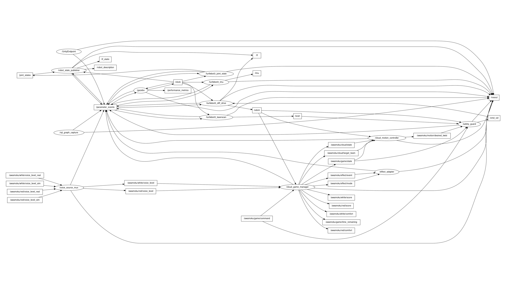

# Awamoku: Unity + ROS 2 Cloud Robot Prototype

「あわもく」は、二組の参加者が声で小型ロボットを呼び、雲のようなキャラクターの反応を体験する Unity + ROS 2 プロトタイプです。Unity は操作と可視化、ROS 2 はゲーム状態・移動・安全制御、Gazebo は TurtleBot3 のシミュレーションを担当します。



## What Works

- TurtleBot3 Burger を Gazebo で起動し、`/odom`、`/scan`、`/tf`、`/cmd_vel` を利用する。
- 赤・白チームの疑似声量から雲の状態、得点、安心度、演出イベントを計算する。
- `cloud_motion_controller` が移動要求を出し、`safety_guard` だけが `/cmd_vel` を publish する。
- Unity の `AwamokuPrototype` シーンで声量入力、状態、座標、速度、バブル演出を確認する。
- `simulation.launch.py` は同一 `ROS_DOMAIN_ID` での二重起動を拒否し、TCP 10000 番ポートが使用中なら子ノードを起動しない。

## Architecture

```text
Unity UI / visual effects
        | ROS-TCP Connector (TCP :10000)
        v
ROS-TCP Endpoint -> voice_source_mux -> cloud_game_manager
                                          |            |
                                          |            +-> effect_adapter -> Unity effects
                                          v
                                  cloud_motion_controller
                                          v
                                   safety_guard -> /cmd_vel -> Gazebo TurtleBot3
                                          ^                         |
                                          +------- /odom, /scan ----+
```

全体の情報の流れは [software architecture flowchart](docs/software-architecture-flowchart.md) を参照してください。設計書とスライド草案はローカル用資料として Git 管理から除外しています。

## Prerequisites

- Ubuntu 22.04
- ROS 2 Humble
- Gazebo 11 と `turtlebot3_gazebo`
- Python 3、`colcon`
- Unity `6000.0.79f1` と ROS-TCP-Connector
- Git（submodule を取得できること）

## Clone and Build

```bash
git clone --recurse-submodules <YOUR_GITHUB_REPOSITORY_URL>
cd UnityRos2Project

source /opt/ros/humble/setup.bash
cd awamoku_ws
colcon build --symlink-install
source install/setup.bash
cd ..
```

既に clone 済みで ROS-TCP-Endpoint が空の場合は、`git submodule update --init --recursive` を実行します。

## Start the Simulation

起動する前に、以前の `ros2 launch awamoku_game ...` を必ず `Ctrl+C` で終了してください。新しい launch には二重起動防止機構があります。既存プロセスまたは TCP 10000 番ポートが残っている場合は、何も起動せず理由を表示して終了します。

```bash
cd /path/to/UnityRos2Project
./tools/run_simulation.sh
```

既定値は `ROS_DOMAIN_ID=30`、`TURTLEBOT3_MODEL=burger`、Endpoint の待受アドレスは `0.0.0.0:10000` です。必要なら起動前に環境変数で変更します。

```bash
export ROS_DOMAIN_ID=30
export TURTLEBOT3_MODEL=burger
export ROS_IP=0.0.0.0
./tools/run_simulation.sh
```

### Check Running Nodes

別ターミナルで実行します。

```bash
cd /path/to/UnityRos2Project
./tools/ros_status.sh
ros2 topic info /cmd_vel
```

`ros_status.sh` はノード名の重複を検出すると終了コード `2` を返します。`/cmd_vel` は `safety_guard` を publisher 1件として表示するのが正常です。

## Open Unity

1. Unity Hub でこのリポジトリを開く。
2. `Assets/Scenes/AwamokuPrototype.unity` を開く。
3. `Assets/Resources/ROSConnectionPrefab` を選択する。
4. Inspector の **ROS IP Address** を、このPCの IPv4 アドレスに設定する。
5. Unity の Play を押す。

IPv4 アドレスは `hostname -I` で確認します。例えば `192.168.1.159` が表示された場合は、その値を Unity に入力します。`0.0.0.0` は ROS-TCP Endpoint の待受用であり、Unity の接続先には使いません。`127.0.0.1` が Unity 側で無効と表示される環境では、上記の IPv4 アドレスを使ってください。

Unity では以下を確認できます。

- Red / White Voice の疑似声量
- Start / Reset / Stop / Estop
- ROS Pose、Unity Cloud、Desired、CmdVel の座標・速度
- 雲の状態、得点、残り時間
- 落ち着かせた側へ向かうバブル演出

## Verify the Game Flow

シミュレーション起動中に、別ターミナルから送信します。

```bash
source /opt/ros/humble/setup.bash
source awamoku_ws/install/setup.bash
export ROS_DOMAIN_ID=30

ros2 topic pub --once /awamoku/game/command std_msgs/msg/String "{data: START}"
ros2 topic pub --rate 5 /awamoku/red/voice_level_sim std_msgs/msg/Float32 "{data: 0.75}"
```

`/awamoku/cloud/state` が `ATTRACT_RED`、`/awamoku/cloud/target_team` が `RED` になることを確認します。停止するには、声量 publisher を `Ctrl+C` で止め、`ros2 topic pub --once /awamoku/game/command std_msgs/msg/String "{data: ESTOP}"` を送信します。

## Tests

```bash
cd awamoku_ws
source /opt/ros/humble/setup.bash
source install/setup.bash
colcon test --packages-select awamoku_game --event-handlers console_direct+
colcon test-result --verbose
```

## Capture the Complete rqt_graph

シミュレーションを1セットだけ起動した状態で、以下を実行します。

```bash
cd /path/to/UnityRos2Project
source /opt/ros/humble/setup.bash
source awamoku_ws/install/setup.bash
export ROS_DOMAIN_ID=30
python3 tools/capture_rqt_graph.py
```

以下が更新されます。

- `docs/images/rqt_graph_complete_16x9.png`: 1920x1080 PNG
- `docs/images/rqt_graph_complete.svg`: 拡大可能な SVG
- `docs/images/rqt_graph_complete.dot`: Graphviz DOT

生成器は `rqt_graph` 本体と同じ ROS 2 グラフ実装を使い、`Nodes/Topics (all)`、終端トピック、TF、アクション、動的再構成を非表示にしません。そのため、Gazebo や ROS の内部トピックを含めた実行時グラフ全体を記録します。

## Repository Layout

```text
Assets/                         Unity scene and C# scripts
Packages/                       Unity packages
ProjectSettings/                Unity project settings
awamoku_ws/src/awamoku_game/    Awamoku ROS 2 package
awamoku_ws/src/ROS-TCP-EndPoint Unity ROS-TCP Endpoint submodule
docs/                           Design documents and generated rqt_graph
tools/                          Launch, status, and graph-capture helpers
```

`Library/`、`UserSettings/`、`awamoku_ws/build/`、`awamoku_ws/install/`、`awamoku_ws/log/`、授業の参考資料はローカル専用であり、GitHubには含めません。

## Publish to GitHub

ローカルで初期コミット後、GitHub で空のリポジトリを作成してから実行します。

```bash
git remote add origin <YOUR_GITHUB_REPOSITORY_URL>
git branch -M main
git push -u origin main
```

clone 側では必ず `--recurse-submodules` を付けるか、`git submodule update --init --recursive` を実行してください。

## Current Scope

実マイク入力、物理LED、送風、泡装置、AR表示はハードウェア未接続のためプレースホルダです。ROS 2、Gazebo、Unity間のゲーム・移動・安全制御・視覚演出のモックは本リポジトリに含まれます。
