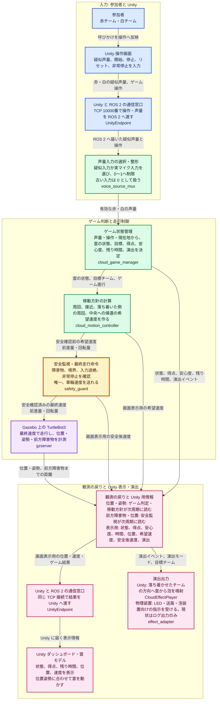

# あわもく ソフトウェア構成フローチャート

この図は、実行時にデータがどこから来て、どのノードが判断し、何を表示・走行へ渡すかを示す。ノード名・通信名は追跡用の補助情報であり、主表記は役割と受け渡す内容である。

## 技術名と渡す情報の対応

| 役割 | ノード / 実装名 | 渡す情報 |
| --- | --- | --- |
| Unity と ROS 2 の橋渡し | `UnityEndpoint` | Unity の声量・操作を ROS 2 へ渡し、ROS 2 の状態・位置・速度・演出を Unity へ渡す。 |
| 声量の選択 | `voice_source_mux` | 疑似声量または実マイク声量を選び、赤・白それぞれの有効な声量を出す。 |
| ルールと得点 | `cloud_game_manager` | 雲の状態、目標チーム、赤白の得点と安心度、残り時間、演出モード・イベントを出す。 |
| 移動方針 | `cloud_motion_controller` | 状態と位置から、安全確認前の前進速度・角速度を出す。 |
| 安全の最終判断 | `safety_guard` | 障害物、境界、タイムアウト、非常停止を確認した最終速度だけを出す。 |
| シミュレーションロボット | `TurtleBot3 / Gazebo` | 位置・姿勢、前方の距離計測を返し、最終速度で走行する。 |
| Unity の画面・雲・泡 | `AwamokuDashboard` ほか | ROS 2 の結果を表示し、位置追従と方向付きバブルを再現する。 |
